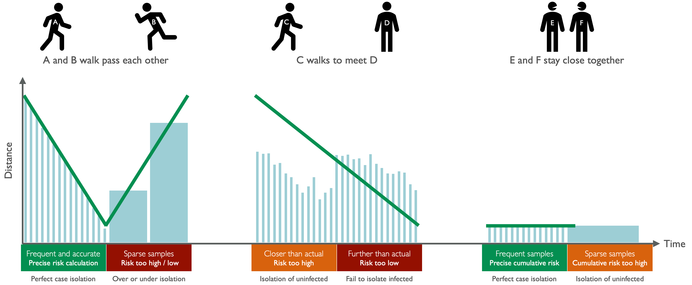
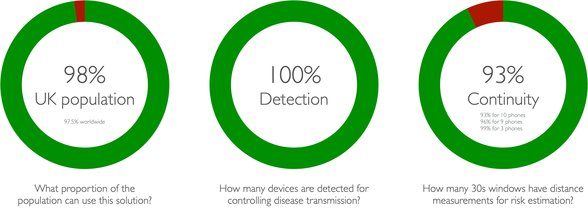

# Herald-for-Android

Continuous proximity detection across iOS and Android devices in background mode for contact tracing and infection control according to epidemiology requirements. 

Copyright 2020 VMware, Inc.

See LICENSE.txt and NOTICE.txt for details.

### Contents

- [Introduction](#introduction)
- [Key features](#key-features)
- [Hardware requirements](#hardware-requirements)
- [Quick start](#quick-start)
- [Test procedure](#test-procedure)
- [Test results](#test-results)
- [Installation](#installation)
- [References](#references)

## Introduction

This solution will:

- Operate on 98.0% of UK phones and 97.5% of phones worldwide without requiring a software update.
- Detect 100% of iOS and Android devices within 8 metres for contact tracing.
- Measure distance between devices at least once every 30 seconds for infection risk estimation.

This is a new, original, free and open source cross-platform proximity detection solution that has been developed according to epidemiology requirements (Ferretti, et al., 2020) for controlling COVID-19. This Bluetooth Low Energy (BLE) based solution offers accurate and frequent distance measurements between phones running iOS 9.3+ and Android 5.0+, including devices that do not support BLE advertising (circa 35% in the UK).

## Key features

- Works on the vast majority of phones in the UK (98.0%) and worldwide (97.5%) by minimising operating system and hardware requirements (Statcounter, 2020).
- Fully operational as a background app on both iOS and Android devices for consistent and continuous use to maximise disease transmission monitoring and control across the population.
- Low power usage (circa 2% per hour) to maximise population acceptance for continuous use.
- Detection and identification of iOS and Android devices in both foreground and background modes is 100% to maximise contact tracing coverage. 
- One or more distance measurement per 30 second window for devices within epidemiologically relevant range (8 metres) for accurate infection risk estimation and case isolation; coverage is > 99.5% of 30 second windows for 2 to 3 devices, and 93% - 96% of windows for 9 to 10 devices.
- RSSI measurements for distance estimation is 98.5% accurate within epidemiologically relevant range (8 metres).
- Device identification payload agnostic to support both centralised, and decentralised approaches, as well as retrospective integration into existing solutions.
- Apache-2.0 licensed and open source for ease of integration, reuse and transparency.

## Hardware requirements

- Operating system

  - iOS 9.3+, tested up to iOS 14.2.
  - Android 5.0+, tested up to Android 10.0 (API level 29).

- Hardware

  - Apple iPhone 4S+, tested up to iPhone 11 Pro.
  - Android phones with BLE, including phones that do not support BLE advertising (circa 35% in UK).

## Quick start

You will need the following items for evaluation (some of our tested versions included for reference).

- Hardware
  - Apple computer (MacBook Pro Late 2013 to Late 2019) running macOS Catalina (10.15.4).
  - One or more Apple iPhones (iPhone 4S, SE, 5, 6, 7, X, 11) running iOS (9.3 to 14.2).
  - One or more Android phones (Samsung A10, A20, A70, J6, S10) running Android (8.0 to 10.0).
- Software
  - Xcode (11.7) for building and deploying the iOS app to test devices.
  - Android Studio for Mac (4.01) for building and deploying the Android app.
  - RStudio for Mac (1.3.1073) for analysing, visualising and summarising test results (optional).

A procedure for installing and testing the solution in background mode is as follows:

1. Clone iOS and Android repos in Xcode and Android.
2. Build, deploy and run test app on iOS and Android devices with Bluetooth OFF.
3. Allow test app to access Bluetooth and Location, move app to background, and lock test devices.
4. Switch Bluetooth ON while devices are locked and app is in background to start test.
5. Place devices within 8 metres of each other and wait for 10 to 30 minutes.
6. Switch Bluetooth OFF while devices are locked and app is in the background to end test.
7. Open app on each device to quickly check other devices were detected and most recent detection time.
8. Download plain text CSV log data files from each device for detailed analysis.

Detailed step-by-step instructions can be found in the [Installation](#installation) section.

## Test procedure

Iterative development was driven by practical experiments and automated testing with a range of common and challenging devices to evaluate the solution according to epidemiology requirements:

- Detection : How many devices are detected for contact tracing?
- Continuity : How many 30 second windows have distance measurements for infection risk estimation?
- Longevity : How much does continuity degrade over time?

Tests were conducted using a selection of common and challenging devices to understand and tackle difficult real world scenarios. Devices used in development included:

- iPhone 4S on iOS 9.3.5 : Minimum hardware and software.
- iPhone SE, 5, 6, 7 on iOS 12.4.2 to iOS 13.6 : Common hardware on common software.
- iPhone X, and 11 Pro on iOS 13.2.3, and 13.6.1 : New hardware on new software.
- Samsung A10, A20 on Android API 28 and 29 : Near constant change of BLE device address.
- Samsung A70, Note 8 on Android API 28 and 29 : Frequent change of BLE device address.
- Samsung J6 on Android API 26, 28 : Does not support BLE advertising.
- Samsung Tab S3 on Android API 26, 28 : BLE crashes easily over time.
- Samsung S10 on Android 29 : New hardware on new software
- Google Pixel 2 on Android API 26, 28, 29 : BLE crashes easily over time.
- Google Pixel 3 on Android 29 : New hardware on new software.

Development assumed the solution will be running in the background with no user interaction and the device is locked as this is the normal and preferred operating condition for user acceptance and for ensuring consistent and continuous usage. Tests were therefore conducted to ensure devices are introduced (come into range of each other) while the app is in the background and device is locked. The general procedure for every test was as follows:

1. Reset device to clean state.
   1. Place test device in Airplane mode and ensure Bluetooth is OFF.
   2. Uninstall test app from device if it has already been installed.
   3. Reboot device (optional, only required if Android or iOS BLE has crashed).
2. Prepare device for test.
   1. Install test app on the device while Bluetooth is OFF.
   2. Open test app and allow required Bluetooth and Location permissions.
   3. Move app to background and lock device.
   4. Disable Airplane mode and ensure Bluetooth is ON for each device, while the device is locked where possible, or at least ensuring the app is in the background if Bluetooth can only be enabled after device unlock, in which case lock the device after enabling Bluetooth.
   5. Place device in a Faraday bag to simulate an active device that is currently out of range.
   6. Repeat procedure for each device, using a separate Faraday bag for each device to ensure isolation.
3. Start test.
   1. Take each test device out of its Faraday bag, taking care to not activate the device in any way in the process.
   2. Place test devices within 8 metres of each other to commence test.
   3. Optional : If location permission is enabled on iOS for the specific test, activate iPhone display for a moment by pressing the home button.
4. End test.
   1. Wait 10 to 30 minutes for a quick test, and 8+ hours for a longer continuity test.
   2. At the end of the test period, place all test devices in Airplane mode and ensure Bluetooth is OFF, while the device is locked where possible, but always ensuring the app remains in the background.
   3. Open app for quick check of test results, then download the full test logs from each device using Finder for iOS and Android File Transfer for Android devices.
   4. Run test results analysis R script to visualise and summarise test results to assess detection and continuity.

## Test results

The following tables present a selection of summary test results for demonstrating the efficacy of the solution. Detection at 100% means all devices detected each other. Continuity at 100% means distance was measured at least once in every 30 second window for every pair of test devices over the entire test period; a value < 100% means distance was not measured in some of the windows for some pairs of test devices.

| Test                              | Devices |   Duration | Detection | Continuity |
| --------------------------------- | ------: | ---------: | --------: | ---------: |
| 1. Android only                   |       3 |   22 hours |    100.0% |      99.6% |
| 2. iOS only (Location ON)         |       2 |   20 hours |    100.0% |     100.0% |
| 3. iOS (Location OFF) and Android |       3 | 80 minutes |    100.0% |      97.1% |
| 4. iOS (Location ON) and Android  |       9 |   13 hours |    100.0% |      96.2% |
| 5. iOS (Location OFF) and Android |      10 |    8 hours |    100.0% |      93.1% |

Test devices were selected to ensure the solution were being tested under the most challenging conditions.

- Test 1 used the Pixel 2 on Android 29 (BLE prone to crash over time), Samsung A20 on Android 28 (BLE device address changes constantly), and Samsung J6 on Android 28 (BLE advertising not supported).
- Test 2 used an iPhone 5 on iOS 12.1.4 and iPhone 6 on iOS 12.4.5 (older hardware) with Location permission enabled but the devices were left static and untouched throughout the test except for the initial handling to disable Airplane mode and switch Bluetooth ON.
- Test 3 used the iPhone 5 and iPhone 6 with Location OFF and the Pixel 2 for enabling indirect detection between the two iPhones.
- Test 4 included all the Android devices in Test 1.
- Test 5 included Android devices that changed BLE device address constantly, and all the iPhones had Location OFF to assess situations where this permission is unacceptable (please note Location permission is mandatory on Android devices and generally acceptable).

## Installation

The proximity detection solution has been integrated into a standalone test app on iOS and Android for ease of evaluation, and to demonstrate how it can be applied in your own apps. The test app will detect, identify and measure distance for all iOS and Android devices within detection range, present the results on a simple user interface, and also write the results to local device storage for download and analysis.

### iOS app installation

1. Open Xcode.
2. Select menu item *Source Control > Clone* to clone the iOS repo as a new project.
3. Select *Target > Signing & Capabilities* to edit *Team* and *Bundle identifier* to resolve name clash if required.
4. Select *Herald.xcodeproj* then select *Target > Signing & Capabilities* to edit *Team* and *Bundle identifier* to resolve name clash if required.
5. Connect iPhone to computer with USB cable, unlock device, select device in Xcode.
6. Select menu item *Product > Run* to build and deploy test app.
7. Expect the test app to open on the device.

### iOS app log files

1. Connect iPhone to computer with USB cable, unlock device, select device in Finder.
2. Expect Finder window to show device details, select *Files* (next to *Info*).
3. Expect a list of apps, select test app to reveal log files (e.g. *contacts.csv*).
4. Drag and drop to copy log files to computer for analysis.

### Android app installation

1. Open Android Studio.
2. Select menu item *VCS > Git > Clone* to clone the Android repo as a new project.
3. Select menu item *File > Sync Project with Gradle Files* to show both *app* and *herald* modules.
4. Select menu item *Build > Make Project* to build *app* and *herald* modules.
5. Enable Developer Mode on Android phone (*Settings > About > Software > Tap Build number repeatedly*).
6. Connect Android phone to computer with USB cable, select device in Android Studio.
7. Select menu item *Run > Run 'app'* to build and deploy test app.
8. Expect the test app to open on the device.

### Android app log files

1. Install and open Android File Transfer utility (https://www.android.com/filetransfer/)
2. Connect Android phone to computer with USB cable, unlock device, ensuring USB Preferences is set to "File transfer".
3. Open Android File Transfer utility.
4. Select path *Android / media / com.vmware.herald.app / Sensor*.
5. Expect a list of log files (e.g. *contacts.csv*).
6. Drag and drop to copy log files to computer for analysis.

## References

Ferretti, L., Wymant, C., Kendall, M., Zhao, L., Nurtay, A., Abeler-Dörner, L., Parker, M., Bonsall, D., and Fraser, C. (2020) "Quantifying SARS-CoV-2 transmission suggests epidemic control with digital contact tracing", *Science*, vol. 368, no. 6491, New York.

Statcounter 2020, *Mobile Operating System Market Share*, Statcounter Global Stats, viewed August 2020, <https://gs.statcounter.com/os-market-share/mobile/worldwide>
